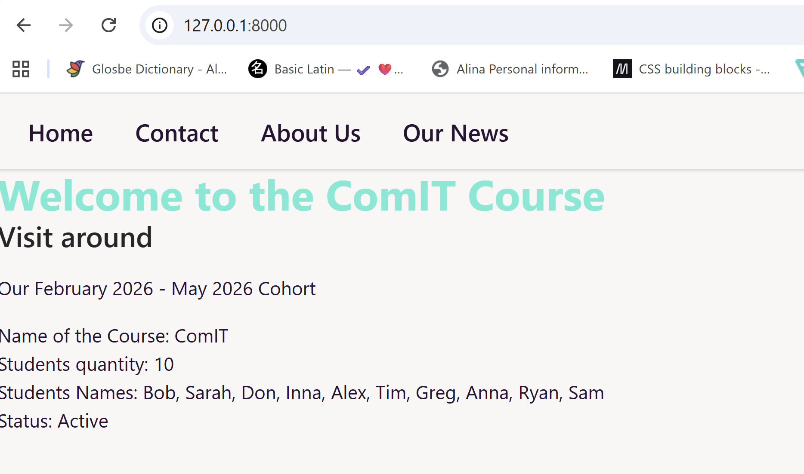
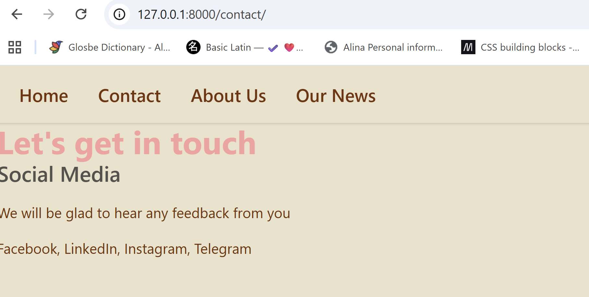
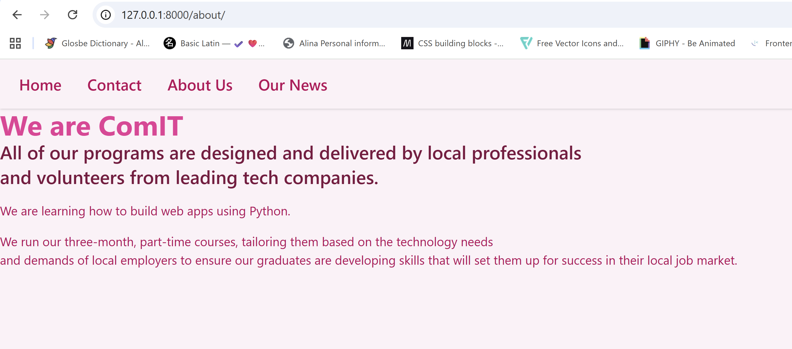
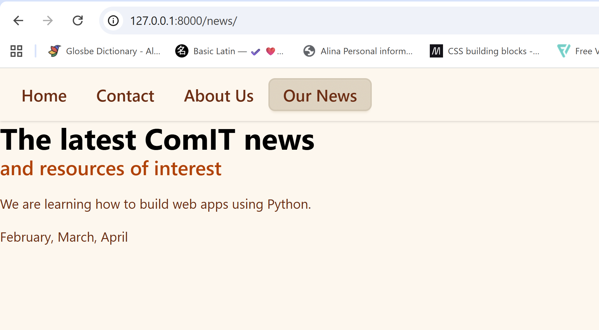

# 🚗 Django Static Pages with Templates + DaisyUI Themes
📌 Overview

This project is a Django web application that demonstrates how to build multiple static pages using templates, a shared base layout, and DaisyUI themes.

Each page uses:

A shared base.html template
A different DaisyUI theme
Dynamic context data passed from views
Django template blocks and loops

## 🚀 Features
4 pages:
Home
Contact
About
News
Base template with reusable layout
DaisyUI theme per page (dynamic via context)
Use of:
Strings
Integers
Booleans
Lists
Dictionaries
Django template loops (for)
Dynamic navigation bar


## Example
### code

config/settings.py
```Python
# Application definition

INSTALLED_APPS = [
    'django.contrib.admin',
    'django.contrib.auth',
    'django.contrib.contenttypes',
    'django.contrib.sessions',
    'django.contrib.messages',
    'django.contrib.staticfiles',
    'stat_pgs_tmpl', # added 
]

TEMPLATES = [
    {
        'BACKEND': 'django.template.backends.django.DjangoTemplates',
        'DIRS': [BASE_DIR, 'templates'], # modified
        'APP_DIRS': True,
        'OPTIONS': {
            'context_processors': [
                'django.template.context_processors.debug',
                'django.template.context_processors.request',
                'django.contrib.auth.context_processors.auth',
                'django.contrib.messages.context_processors.messages',
            ],
        },
    },
]

STATIC_URL = '/static/' # modified

STATICFILES_DIRS = [   # added
    BASE_DIR / "static",
]
```

config/urls.py
```Python
from django.contrib import admin
from django.urls import path
from stat_pgs_tmpl import views

urlpatterns = [
    path('', views.home, name="home"),
    path('contact/', views.contact, name="contact"),
    path('about/', views.about, name="about"),
    path('news/', views.news, name="news"),
]

```

templates/stat_pgs_tmpl/base.html
```HTML

<!DOCTYPE html>
<html lang="en">

<head>
    <meta charset="UTF-8">
    <meta name="viewport" content="width=device-width, initial-scale=1.0">
    <title>My cool website with templates </title>
    <link rel="stylesheet" href="" type="text/css">
    <script src=""></script>
    <link rel="stylesheet" href="" type="text/css">
    <html lang="en" data-theme="{{ theme }}"></html>
</head>

<body>
    <header>
        <div class="navbar bg-base-100 shadow-sm">
            
                <a class="btn btn-ghost text-xl" href="/">Home</a>
                <a class="btn btn-ghost text-xl" href="/contact/">Contact</a>
                <a class="btn btn-ghost text-xl" href="/about/">About Us</a>
                <a class="btn btn-ghost text-xl" href="/news/">Our News</a>
            
        </div>

        
    </header>
    <h1 class="text-4xl font-bold text-primary">My H1</h1>
    <h2 class="text-2xl font-semibold text-neutral">My H2</h2>
    <p class="py-4 text-base-content"> My paragraph</p>
    <main>
        My Main Content
    </main>

</body>
</html>
```

templates/stat_pgs_tmpl/home.html
```HTML


Home

Welcome to the ComIT Course
Visit around
Our February 2026 - May 2026 Cohort


<ol>
  <li>Name of the Course: {{ name }}</li>
  <li>Students quantity: {{ students }}</li>

  <li>
    Students Names:
    
      {{ student }}, 
    
  </li>

  <li>Status: {{ is_active|yesno:"Active,Inactive" }}</li>
</ol>

```

stat_pgs_tmpl/views.py

```Python
from django.shortcuts import render

def home(request):
    ctx = {
        "theme": "cupcake",
        "name": "ComIT",
        "students": 10,
        "names": ["Bob", "Sarah", "Don", "Inna", "Alex", "Tim", "Greg", "Anna", "Ryan", "Sam"],
        "is_active": True
    }
    return render(request, 'stat_pgs_tmpl/home.html', ctx)


def contact(request):
  ctx = {
     "theme": "retro",
     "medias": ["Facebook", "LinkedIn", "Instagram", "Telegram"]
  }
  return render(request, 'stat_pgs_tmpl/contact.html', ctx)


def about(request):
    ctx = {
        "theme": "valentine"
    }
    return render(request, 'stat_pgs_tmpl/about.html', ctx)


def news(request):
    ctx = {
        "theme": "caramellatte",
        "news": ["February", "March", "April"]
    }
    return render(request, 'stat_pgs_tmpl/news.html', ctx)

```

### Rendering

home


contact


about


news
